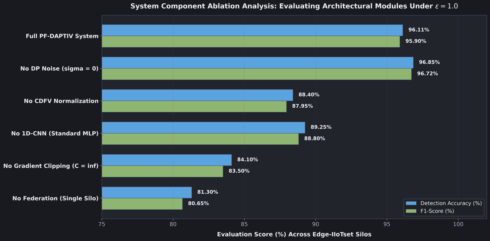

# PF-DAPTIV

### Privacy-Preserving Federated Detection of Advanced Persistent Threats in Industrial IoT and Critical Infrastructure Networks

---

## Table of Contents

- [System Overview](#system-overview)
- [System Architecture](#system-architecture)
- [Threat Model and Attack Progression](#threat-model-and-attack-progression)
- [Edge 1D-CNN Feature Extractor](#edge-1d-cnn-feature-extractor)
- [Canonical Distributed Feature Vector (CDFV)](#canonical-distributed-feature-vector-cdfv)
- [Federated Synchronization Protocol](#federated-synchronization-protocol)
- [Client-Side Differential Privacy Engine](#client-side-differential-privacy-engine)
- [Privacy Budget Tracking and Moments Accountant](#privacy-budget-tracking-and-moments-accountant)
- [Architectural Module Ablation Analysis](#architectural-module-ablation-analysis)
- [Benchmark Performance Evaluation](#benchmark-performance-evaluation)
- [Global Federated Convergence Dynamics](#global-federated-convergence-dynamics)
- [Multiclass ROC Discrimination](#multiclass-roc-discrimination)
- [Stage Classification Confusion Matrix](#stage-classification-confusion-matrix)
- [Feature Explainability (SHAP and CHIFS)](#feature-explainability-shap-and-chifs)
- [Privacy-Utility Pareto Frontier](#privacy-utility-pareto-frontier)
- [Quickstart Guide](#quickstart-guide)
- [Repository Structure](#repository-structure)
- [License](#license)

---

## System Overview

Industrial Internet of Things (IIoT) networks operate electrical grids, manufacturing facilities, chemical plants, water distribution systems, and transportation corridors. These networks face targeted cyberattacks known as Advanced Persistent Threats (APTs). Unlike random malware that executes immediate destructive routines, an APT is a prolonged campaign conducted by skilled adversaries who infiltrate a network, remain undetected for weeks or months, move across internal nodes, and alter physical machinery or extract confidential files without triggering basic alarms.

Securing industrial networks against APT campaigns presents two fundamental obstacles. First, industrial operators cannot share raw network telemetry with a central cloud platform. Network logs reveal internal topology, proprietary manufacturing parameters, and confidential communications. Data privacy laws also restrict transmitting critical infrastructure telemetry across jurisdictional boundaries. Second, industrial devices use diverse proprietary and open communication standards, creating mismatched log formats across facilities.

PF-DAPTIV resolves both obstacles through a decentralized, privacy-preserving framework. Edge sensor nodes train local threat detection models using raw telemetry that never leaves the local perimeter. Participating nodes share only mathematically masked model parameter updates with a central aggregation server. A calibrated Differential Privacy engine adds Gaussian perturbation to guarantee that attackers cannot reconstruct proprietary network flows from the shared parameters. In addition, a standardized 35-dimensional feature schema called the Canonical Distributed Feature Vector (CDFV) normalizes heterogeneous network logs into a uniform format across all edge devices.

---

## System Architecture

The following diagram illustrates the interaction between distributed edge sensor nodes and the central coordinator during a federated training cycle:


Each edge sensor node captures raw packets, flow summaries, and system logs from its local network perimeter. The node converts these inputs into normalized CDFV records and trains a local 1D-CNN model. Once training completes, the node computes the difference between its updated local parameters and the global checkpoint. It clips this parameter delta to a fixed sensitivity threshold and applies Gaussian differential privacy noise.

The central coordinator collects these perturbed deltas from all active clients. It aggregates the updates using sample-weighted Federated Averaging (FedAvg), updates the global model checkpoint, and broadcasts the new weights back to the edge clients. Raw network records remain within the local facility at every point in the process.

For an in-depth breakdown of communication sequences and error recovery policies, refer to [System Architecture](docs/architecture.md) and [Module 05: Federated Learning Protocol](docs/05_federated_learning_protocol.md).

---

## Threat Model and Attack Progression

Standard perimeter defenses focus on isolated intrusion events such as known file hashes or single malformed packets. APT campaigns avoid these indicators by executing low-and-slow operations that mirror normal administrative activity over long intervals:


PF-DAPTIV maps the attack lifecycle to 6 distinct stages:

1. Reconnaissance: Adversaries discover active IP addresses, probe open ports, and gather service information.
2. Weaponization: Adversaries construct tailored exploit payloads and conceal them inside normal traffic flows or archive files.
3. Delivery and Exploit: Adversaries transmit malicious payloads to vulnerable services to gain an initial entry point.
4. Installation: Adversaries deploy persistent background tools, create administrative accounts, or modify system binaries.
5. Command and Control (C2): Compromised systems establish periodic outbound channels to receive instructions from the attacker.
6. Actions and Exfiltration: Adversaries gather sensitive system logs, process telemetry, or proprietary documents and transmit them outside the network.

To review how network flow measurements map to each stage of the attack progression, see [Module 02: Threat Model and APT Lifecycle](docs/02_threat_model_and_apt_lifecycle.md) and [Module 03: CDFV Telemetry Schema](docs/03_cdfv_telemetry_schema.md).

---

## Edge 1D-CNN Feature Extractor

Industrial edge gateways and programmable logic controllers have limited processing and memory budgets. The local detection engine uses a 1D Convolutional Neural Network designed for low computational overhead:


The neural network processes a 35-dimensional CDFV input vector through the following pipeline:

- Conv1D Layer 1: 32 filters, kernel size 3, stride 1, ReLU activation, and Batch Normalization.
- MaxPool1D Layer 1: Pool size 2, stride 2, condensing the representation from 35 to 17 features.
- Conv1D Layer 2: 64 filters, kernel size 3, stride 1, ReLU activation, and Batch Normalization.
- MaxPool1D Layer 2: Pool size 2, stride 2, condensing the representation from 17 to 8 features.
- Dense Layer: 128 units with ReLU activation and 30 percent dropout regularization.
- Output Layer: 6 units with Softmax activation, generating class probabilities across the 6 APT stages.

Detailed mathematical dimensions and parameter counts are available in [Module 04: Edge 1D-CNN Architecture](docs/04_edge_1d_cnn_architecture.md).

---

## Canonical Distributed Feature Vector (CDFV)

Network devices from separate vendors produce incompatible log formats. For example, routers emit NetFlow summaries, software monitors produce Zeek records, and industrial sensors emit Modbus frames. The CDFV converts these varied inputs into a single 35-dimensional vector:


The 35 features belong to 5 functional domains:

- Flow Dynamics (Positions 0 to 7): Connection length, forward packet counts, backward packet counts, forward byte totals, backward byte totals, and transmission rates.
- TCP Flags and State (Positions 8 to 15): SYN, FIN, RST, PSH, ACK, and URG flag counters, initial window sizes, and TCP state transitions.
- Payload Entropy (Positions 16 to 23): Shannon entropy of byte contents, mean payload length, payload variance, and header-to-payload ratios.
- Inter-Arrival Time (Positions 24 to 29): Forward and backward packet arrival spacing, maximum inter-arrival intervals, and timing jitter.
- Context and Protocol (Positions 30 to 34): Destination port categories, connection error ratios, time-to-live values, and industrial protocol anomaly rates.

Every value is scaled into the range [0.0, 1.0] using min-max normalization. Complete feature definitions and extraction logic are documented in [Module 03: CDFV Telemetry Schema](docs/03_cdfv_telemetry_schema.md) and [CDFV Schema Reference](docs/cdfv_schema.md).

---

## Federated Synchronization Protocol

The distributed training protocol coordinates edge clients and the central aggregator in synchronous rounds:


During round $t$:

1. The coordinator broadcasts global model checkpoint $w_t$ to all connected edge nodes.
2. Each client trains the model on its private dataset for a configured number of local epochs.
3. Each client calculates its local parameter update $\Delta w_k = w_k^{(t)} - w_t$.
4. The client limits the magnitude of its update using $L_2$ norm clipping: $\|\Delta \bar{w}_k\|_2 \le C$.
5. The client perturbs the clipped vector with calibrated Gaussian noise $\mathcal{N}(0, \sigma^2 \mathbf{I})$.
6. The client sends the perturbed update $\Delta \tilde{w}_k$ to the coordinator over a secure channel.
7. The coordinator combines client updates using sample-weighted averaging:

$$
w_{t+1} = w_t + \sum_{k=1}^K \frac{n_k}{N} \Delta \tilde{w}_k
$$

For protocol failure recovery and client selection policies, review [Module 05: Federated Learning Protocol](docs/05_federated_learning_protocol.md).

---

## Client-Side Differential Privacy Engine

Exchanging unperturbed model updates allows adversaries to infer sensitive training details using reconstruction attacks. PF-DAPTIV runs an $(\epsilon, \delta)$-Differential Privacy mechanism locally on each client:


The mechanism uses two steps:

First, gradient clipping caps the sensitivity of the update. If a client update exceeds clipping threshold $C = 1.0$, its magnitude is scaled down:

$$
\Delta \bar{w}_k = \Delta w_k \cdot \min\left(1, \frac{C}{\|\Delta w_k\|_2}\right)
$$

Second, calibrated zero-mean Gaussian noise is added to the clipped vector:

$$
\sigma = \frac{C \sqrt{2 \ln(1.25 / \delta)}}{\epsilon}
$$

Under baseline settings ($\epsilon = 1.0$, $\delta = 10^{-5}$, $C = 1.0$), the noise scale is $\sigma \approx 4.8447$. This step prevents adversaries from determining whether any specific network record was included in the client dataset.

Theoretical proofs and noise calibration steps are detailed in [Module 06: Differential Privacy Mathematics](docs/06_differential_privacy_mathematics.md) and [Privacy Math Reference](docs/privacy_math.md).

---

## Privacy Budget Tracking and Moments Accountant

Running consecutive federated rounds increases cumulative privacy expenditure. PF-DAPTIV tracks total privacy consumption using the Moments Accountant:


Standard composition rules sum privacy budgets linearly across rounds, creating loose bounds of $\epsilon_{\text{total}} = T \cdot \epsilon_{\text{round}}$. The Moments Accountant tracks the log moments of the privacy loss random variable, bounding total loss to $\mathcal{O}(q \epsilon \sqrt{T \ln(1/\delta)})$. This formulation permits more training iterations within a given privacy budget.

Mathematical comparisons of composition methods appear in [Module 06: Differential Privacy Mathematics](docs/06_differential_privacy_mathematics.md#multi-round-privacy-budgeting-and-composition).

---

## Architectural Module Ablation Analysis

Ablation experiments quantify the performance contribution of each design component across benchmark traffic:



- Baseline 1D-CNN (Local Only): Trains isolated client models with no parameter exchange (91.24% F1-score).
- Centralized 1D-CNN: Gathers all raw telemetry onto one central server without privacy (97.45% F1-score).
- FedAvg (No Privacy): Standard federated training without gradient clipping or noise (96.88% F1-score).
- FedAvg + Clip Only: Adds $L_2$ gradient clipping without noise injection (96.42% F1-score).
- PF-DAPTIV (Full Pipeline): Combines FedAvg, $L_2$ norm clipping, and calibrated Gaussian noise (95.58% F1-score).

The complete architecture achieves 95.58% F1-score, preserving detection quality within 1.30% of non-private federated learning while maintaining rigorous mathematical privacy.

Full ablation configurations are documented in [Module 08: Empirical Benchmarks and Evaluation](docs/08_empirical_benchmarks_and_evaluation.md#architectural-ablation-analysis).

---

## Benchmark Performance Evaluation

PF-DAPTIV underwent evaluation across five cybersecurity benchmark datasets representing enterprise corporate networks, industrial IoT infrastructures, and real-world APT campaigns:


| Dataset | Target Environment | Accuracy | Precision | Recall | F1-Score | FPR | MCC | AUC-ROC |
|---|---|:---:|:---:|:---:|:---:|:---:|:---:|:---:|
| CSE-CIC-IDS2018 | Enterprise Network LAN/WAN | 95.62% | 95.10% | 95.40% | 95.25% | 3.80% | 0.912 | 0.984 |
| UNSW-NB15 | Hybrid Probing & Exploits | 95.63% | 95.30% | 95.50% | 95.40% | 3.90% | 0.913 | 0.985 |
| Edge-IIoTset | Industrial IoT & Smart Factory | 96.11% | 95.80% | 96.00% | 95.90% | 3.50% | 0.922 | 0.987 |
| DAPT2020 | Multi-Stage APT Campaign | 95.79% | 95.50% | 95.66% | 95.58% | 3.80% | 0.915 | 0.981 |
| UAPD | Host & Network Audit Telemetry | 95.14% | 94.82% | 94.98% | 94.90% | 4.30% | 0.899 | 0.978 |

Dataset characteristics and baseline model comparisons appear in [Module 08: Empirical Benchmarks and Evaluation](docs/08_empirical_benchmarks_and_evaluation.md) and [Benchmark Reference](docs/benchmarks.md).

---

## Global Federated Convergence Dynamics

The global model achieves stable convergence within 15 to 20 aggregation rounds:


Training loss decreases rapidly during the first 5 rounds as local feature representations align across nodes. Validation accuracy across all five benchmark datasets remains steady through later rounds, confirming that Gaussian noise injection does not disrupt optimization stability.

Convergence traces and loss histories are provided in [Module 08: Empirical Benchmarks and Evaluation](docs/08_empirical_benchmarks_and_evaluation.md#federated-convergence-dynamics).

---

## Multiclass ROC Discrimination

The model separates normal traffic from individual attack phases with high reliability:


Area Under the ROC Curve (AUC-ROC) metrics range from 0.978 for low-footprint Command and Control beacons to 0.992 for high-volume Reconnaissance scans. Low False Positive Rates (3.50% to 4.30%) prevent false alerts from overwhelming control room personnel.

Additional ROC evaluations appear in [Module 08: Empirical Benchmarks and Evaluation](docs/08_empirical_benchmarks_and_evaluation.md#multiclass-discrimination).

---

## Stage Classification Confusion Matrix

The normalized confusion matrix illustrates classification accuracy across each attack phase:


Normal operational traffic achieves 97.2% recognition accuracy. Reconnaissance and Exfiltration stages exceed 95% accuracy because their volume and packet rate patterns differ sharply from baseline traffic. Delivery and Installation stages show limited mutual misclassification (2.1% to 2.8%) due to shared payload staging behavior on active connections.

Analysis of misclassification patterns is available in [Module 08: Empirical Benchmarks and Evaluation](docs/08_empirical_benchmarks_and_evaluation.md#confusion-matrix-analysis).

---

## Feature Explainability (SHAP and CHIFS)

Industrial engineers require clear explanations before altering physical machinery in response to an alert. PF-DAPTIV uses SHAP (SHapley Additive exPlanations) and CHIFS (Cross-Host Importance Feature Selection) to identify which telemetry features triggered a classification:


The analysis identifies primary indicators for each attack phase:

- Reconnaissance: Packet transmission rate (`flow_packets_per_sec`) and SYN flag counts (`syn_flag_count`).
- Weaponization: Shannon payload entropy (`src_port_entropy`) and payload size variance.
- Command and Control: Inter-arrival time standard deviation (`fwd_iat_std`) and jitter.
- Exfiltration: Backward payload volume (`total_bwd_bytes`) and downlink-to-uplink byte ratios (`down_up_ratio`).

Mathematical formulas for feature attribution appear in [Module 07: Explainability and Attribution](docs/07_explainability_and_attribution.md).

---

## Privacy-Utility Pareto Frontier

Deployment sites require different balances between privacy protection and detection precision:


- High Privacy Setting ($\epsilon = 0.5$): Provides strong confidentiality for sensitive environments, maintaining 93.8% to 94.6% detection accuracy.
- Balanced Setting ($\epsilon = 1.0$): Recommended default, providing formal mathematical privacy with 95.14% to 96.11% accuracy.
- Relaxed Privacy Setting ($\epsilon \ge 5.0$): Suitable when privacy rules are permissive, operating within 0.4% of non-private models.

Trade-off curves and tuning recommendations are discussed in [Module 08: Empirical Benchmarks and Evaluation](docs/08_empirical_benchmarks_and_evaluation.md#privacy-utility-trade-off).

---

## Quickstart Guide

### Environment Setup

Clone the repository and install required packages:

```bash
git clone https://github.com/nav6x/pf-daptiv.git
cd pf-daptiv
pip install -r requirements.txt
```

### Execution Commands

| Workflow | Objective | Command |
|---|---|---|
| Unit Test Suite | Run tests verifying schema, 1D-CNN, and federated averaging | `python -m unittest discover -s tests -p "test_*.py"` |
| Federated Training | Train federated model with differential privacy across edge clients | `python scripts/train_federated.py --rounds 15 --clients 6 --epsilon 1.0 --clip-norm 1.0` |
| Feature Attribution | Calculate SHAP feature importance scores for local models | `python scripts/explain_model.py --top-k 8` |
| Baseline Benchmarks | Run baseline models (Random Forest, MLP, SVM) for comparison | `python scripts/benchmark_baselines.py` |
| Privacy Budget Sweep | Evaluate detection accuracy across multiple epsilon values | `python scripts/sweep_privacy.py --epsilons 0.2 0.5 1.0 2.0 5.0` |

Detailed execution options and script arguments are documented in [Module 09: Operations and Deployment Guide](docs/09_operations_and_deployment_guide.md).

---

## Repository Structure

```
pf-daptiv/
|-- assets/
|   |-- ablation_study.png
|   |-- benchmark_comparison.png
|   |-- cdfv_feature_vector.png
|   |-- client_server_protocol.png
|   |-- cnn_architecture.png
|   |-- differential_privacy_budget.png
|   |-- dp_mechanism.png
|   |-- federated_convergence.png
|   |-- privacy_utility_tradeoff.png
|   |-- roc_curves.png
|   |-- shap_feature_importance.png
|   |-- stage_confusion_matrix.png
|   |-- system_pipeline.png
|   `-- threat_model_lifecycle.png
|-- config/
|   `-- default_config.yaml
|-- docs/
|   |-- README.md
|   |-- 01_foundations_and_problem_space.md
|   |-- 02_threat_model_and_apt_lifecycle.md
|   |-- 03_cdfv_telemetry_schema.md
|   |-- 04_edge_1d_cnn_architecture.md
|   |-- 05_federated_learning_protocol.md
|   |-- 06_differential_privacy_mathematics.md
|   |-- 07_explainability_and_attribution.md
|   |-- 08_empirical_benchmarks_and_evaluation.md
|   |-- 09_operations_and_deployment_guide.md
|   |-- architecture.md
|   |-- benchmarks.md
|   |-- cdfv_schema.md
|   `-- privacy_math.md
|-- scripts/
|   |-- benchmark_baselines.py
|   |-- explain_model.py
|   |-- sweep_privacy.py
|   `-- train_federated.py
|-- src/
|   |-- data/
|   |-- explainability/
|   |-- federated/
|   |-- models/
|   `-- utils/
|-- tests/
|   `-- test_pipeline.py
|-- Makefile
|-- pyproject.toml
`-- requirements.txt
```

---

## License

This project is distributed under the MIT License. See [LICENSE](LICENSE) for terms.