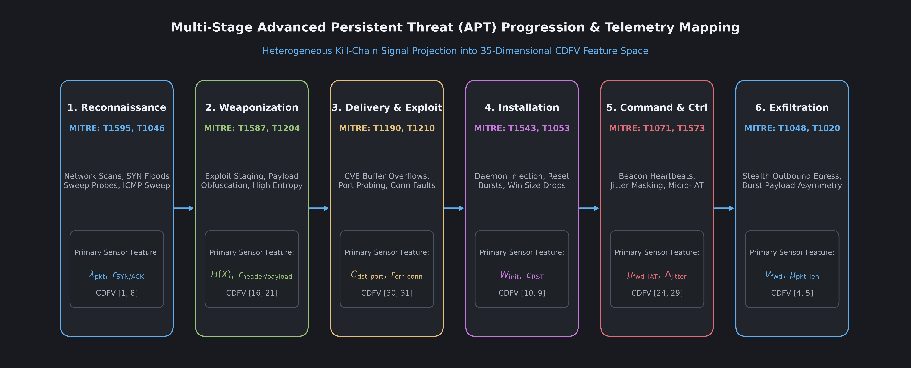

# Module 02: Threat Model and APT Attack Lifecycle

---

## 1. The Anatomy of an Advanced Persistent Threat Campaign

Unlike automated worms that spread in minutes, an Advanced Persistent Threat unfolds across weeks or months. Attackers proceed through deliberate, sequential phases designed to gather intelligence, consolidate control, and minimize detectability before executing their primary objective.

During early phases, attack traffic looks nearly indistinguishable from benign administrative sessions. An adversary may send one probe packet every ten minutes to avoid threshold alerts on security gateways. This low-and-slow execution curve demands multi-stage behavioral detection that observes subtle shifts across multiple telemetry dimensions.

---

## 2. The 6-Stage APT Lifecycle Taxonomy

PF-DAPTIV organizes network behaviors into 6 discrete, sequential stages. This structured taxonomy allows machine learning models to identify where an attacker currently operates within a network kill chain:

### Stage 0: Normal Baseline Operations
- Operational Context: Standard factory operations, regular polling cycles between human-machine interfaces (HMIs) and PLCs, automated database backups, and routine web browsing by operators.
- Telemetry Signatures: Predictable packet inter-arrival times, low port entropy, zero Modbus exception responses, and balanced forward/backward byte distributions.

### Stage 1: Reconnaissance
- Objective: The adversary gathers intelligence about target IP ranges, accessible subnets, active listening ports, and operational software versions.
- MITRE ATT&CK Mapping: TA0043 (Reconnaissance), T1595 (Active Scanning), T1046 (Network Service Discovery), T1018 (Remote System Discovery).
- Telemetry Signatures: High transmission rates of SYN packets without completing TCP handshakes, sharp increases in packet rates (`flow_packets_per_sec`), elevated destination port entropy (`dst_port_entropy`), and short connection lifespans.

### Stage 2: Weaponization
- Objective: The adversary crafts an exploit payload tailored to the specific vulnerabilities discovered during reconnaissance. This includes embedding malicious macros in documents, compiling custom shellcode, or constructing malformed industrial commands.
- MITRE ATT&CK Mapping: TA0001 (Initial Access), T1587 (Develop Capabilities), T1204 (User Execution), T1588 (Obtain Capabilities).
- Telemetry Signatures: High Shannon payload entropy ($H(X)$) indicating encrypted or obfuscated shellcode, anomalous forward packet sizes (`fwd_packet_len_mean`), and brief staging connections.

### Stage 3: Delivery and Exploitation
- Objective: The adversary delivers the weaponized payload to a vulnerable service, executing code to breach the facility perimeter.
- MITRE ATT&CK Mapping: TA0002 (Execution), TA0003 (Persistence), T1190 (Exploit Public-Facing Application), T1210 (Exploitation of Remote Services), T1059 (Command and Scripting Interpreter).
- Telemetry Signatures: Bursts of push-flagged packets (`psh_flag_count`), elevated HTTP client/server error rates (`http_error_ratio`), irregular TCP window sizes (`init_win_bytes_fwd`), and unauthorized Modbus write commands.

### Stage 4: Installation and Foothold Establishment
- Objective: To survive system reboots and administrative sweeps, the adversary installs persistent backdoors, registers scheduled tasks, or modifies system service daemons.
- MITRE ATT&CK Mapping: TA0003 (Persistence), TA0004 (Privilege Escalation), T1543 (Create or Modify System Process), T1053 (Scheduled Task), T1547 (Boot or Logon Autostart Execution).
- Telemetry Signatures: Spikes in TCP reset counters (`rst_flag_count`), repeated short internal connection attempts to neighboring machines, and lateral traversal probes.

### Stage 5: Command and Control (C2)
- Objective: Compromised internal machines establish communication channels to an external command-and-control server operated by the adversary to receive further instructions.
- MITRE ATT&CK Mapping: TA0011 (Command and Control), T1071 (Application Layer Protocol), T1573 (Encrypted Channel), T1090 (Proxy), T1095 (Non-Application Layer Protocol).
- Telemetry Signatures: Low-jitter periodic beaconing characterized by low standard deviation in inter-arrival times (`fwd_iat_std`), repetitive connection durations, elevated DNS lookup frequencies (`dns_query_rate`), and small uniform packet sizes.

### Stage 6: Actions and Exfiltration
- Objective: The adversary executes their final mission. This involves exfiltrating proprietary engineering files or issuing destructive commands to physical actuators and PLCs.
- MITRE ATT&CK Mapping: TA0010 (Exfiltration), TA0040 (Impact), T1048 (Exfiltration Over Alternative Protocol), T1020 (Automated Exfiltration), T1499 (Endpoint Denial of Service), T0855 (Unauthorized Command Message).
- Telemetry Signatures: Heavy asymmetric byte transfers in the backward direction (`total_bwd_bytes`), inverted downlink-to-uplink byte ratios (`down_up_ratio`), prolonged connection durations, and anomalous DNP3 or Modbus exception abort rates (`dnp3_abort_rate`).

---

## 3. Threat Model Assumptions and Security Guarantees

Designing a defense system requires clearly defining what the adversary can and cannot do:

### Attacker Capabilities
1. The adversary can compromise one or more edge sensor nodes and observe local network traffic.
2. The adversary can eavesdrop on communications between edge nodes and the central coordinator.
3. The adversary can act as an honest-but-curious participant in federated learning, attempting to reconstruct other facilities data by analyzing global model updates (model inversion attacks).
4. The adversary cannot break standard cryptographic primitives (such as TLS encryption).
5. The adversary cannot modify the internal memory of edge devices that have not been physically or digitally breached.

### Defender Guarantees
1. Telemetry Localization: Raw network traffic never leaves the perimeter of the originating facility.
2. Differential Privacy: Even if the adversary controls the central aggregation server, the mathematical noise added to model updates bounds information leakage to $(\epsilon, \delta)$.
3. Model Integrity: Weighted federated averaging prevents a single compromised edge node from overriding the global model.

---

## 4. Frequently Asked Questions

### Q: Why classify traffic into 6 stages rather than simply binary benign vs. malicious?
A: Binary classification only tells an operator that something is wrong, without providing context on urgency. Detecting an attack in Stage 1 (Reconnaissance) allows defenders to patch firewalls before a breach occurs. Detecting an attack in Stage 6 (Exfiltration) demands immediate isolation of physical processes to stop sabotage.

### Q: How does PF-DAPTIV handle attackers who skip stages?
A: The 1D-CNN evaluates each incoming telemetry window independently. If an attacker uses stolen credentials to access Stage 5 (C2) directly, the model detects the periodic timing patterns without requiring preceding Stage 1 records.

---

## 5. Next Learning Module

Proceed to [Module 03: CDFV Telemetry Schema](03_cdfv_telemetry_schema.md) to examine the mathematical feature representation and normalization pipeline that converts raw network packets into standardized model inputs.
