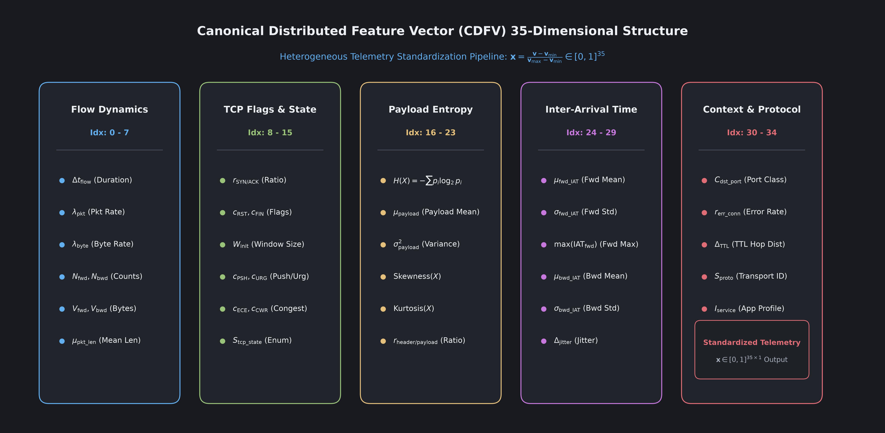

# Module 03: Feature Engineering and the CDFV Schema

---

**This entire document describes a fictional feature schema that does not match the actual code.** The real 35 CDFV feature names are defined in `src/data/cdfv_schema.py` (`CDFV_FEATURE_NAMES`) and are things like `fwd_pkts_per_sec`, `ct_dst_src_ltm`, `tcp_ack_raw`, `mqtt_msgtype`, `c2_interval`, `beacon_rate`, `proc_creation_rate`, `auth_fail_cnt`, `registry_writes`, `pdi`, `bcv`, `pe`, `lhc`, `er`, `dt`. Not one of the 35 feature names below (`total_fwd_packets`, `flow_bytes_per_sec`, `syn_flag_count`, `dst_port_entropy`, `modbus_exception_rate`, `dnp3_abort_rate`, etc.) exists anywhere in the source tree, and several of the real schema's own abbreviated feature names (`pdi`, `bcv`, `pe`, `lhc`, `er`, `dt`) have no documented physical meaning at all in the codebase, so this document cannot be trusted as a description of what the code actually computes. It is left in place unmodified below so the discrepancy is visible, but should be treated as unreliable pending a real rewrite grounded in `src/data/cdfv_schema.py` and the actual parser implementations in `src/data/parsers/`.

---

## 1. The Challenge of Telemetry Heterogeneity

Industrial facilities generate telemetry in incompatible data formats. A facility might capture raw packet dumps using Wireshark, export flow summaries using Cisco NetFlow v9, record connection states using Zeek event engines, or log register reads via Modbus protocol analyzers.

Machine learning models require input data with a fixed number of numerical features in a consistent order. If Client A supplies 80 features and Client B supplies 20 features, a neural network cannot train across both clients.

The Canonical Distributed Feature Vector (CDFV) resolves this problem by establishing a universal, invariant 35-position numerical template. Whatever logging software a facility runs, local preprocessing adapters extract and project traffic into this standardized format.

---

## 2. The Five Feature Functional Groups

The 35 features are organized into 5 continuous blocks. Arranging related metrics into adjacent vector positions enables the 1D-CNN convolutional filters to learn spatial and temporal relationships across correlated signals:

### Group 1: Flow Dynamics (Indices 0 to 7)
Measures connection volume, duration, packet counts, and flow rates:
- Index 0: `flow_duration` (Lifespan of the connection in seconds)
- Index 1: `total_fwd_packets` (Packet count from client to server)
- Index 2: `total_bwd_packets` (Packet count from server to client)
- Index 3: `total_fwd_bytes` (Payload byte total in forward direction)
- Index 4: `total_bwd_bytes` (Payload byte total in backward direction)
- Index 5: `fwd_packet_len_max` (Maximum packet length forward)
- Index 6: `fwd_packet_len_min` (Minimum packet length forward)
- Index 7: `fwd_packet_len_mean` (Average packet length forward)

### Group 2: TCP Flags and State (Indices 8 to 15)
Measures handshake dynamics, connection teardowns, and transmission rates:
- Index 8: `bwd_packet_len_max` (Maximum packet length backward)
- Index 9: `bwd_packet_len_min` (Minimum packet length backward)
- Index 10: `bwd_packet_len_mean` (Average packet length backward)
- Index 11: `flow_bytes_per_sec` (Transfer rate in bytes per second)
- Index 12: `flow_packets_per_sec` (Transfer rate in packets per second)
- Index 13: `fwd_iat_mean` (Mean forward packet inter-arrival time)
- Index 14: `fwd_iat_std` (Standard deviation of forward inter-arrival time)
- Index 15: `bwd_iat_mean` (Mean backward packet inter-arrival time)

### Group 3: Payload Entropy and Structure (Indices 16 to 23)
Distinguishes plain text industrial commands from encrypted attack payloads:
- Index 16: `bwd_iat_std` (Standard deviation of backward inter-arrival time)
- Index 17: `syn_flag_count` (TCP SYN flag count)
- Index 18: `fin_flag_count` (TCP FIN flag count)
- Index 19: `rst_flag_count` (TCP RST flag count)
- Index 20: `psh_flag_count` (TCP PSH push flag count)
- Index 21: `ack_flag_count` (TCP ACK acknowledgment flag count)
- Index 22: `urg_flag_count` (TCP URG urgent flag count)
- Index 23: `down_up_ratio` (Ratio of downloaded bytes to uploaded bytes)

Shannon entropy is calculated across packet payload bytes:

$$
H(X) = - \sum_{i=0}^{255} P(b_i) \log_2 P(b_i)
$$

Where $P(b_i)$ is the empirical probability of byte value $b_i$ appearing in the payload. High entropy indicates encryption or obfuscation, while low entropy indicates structured industrial telemetry.

### Group 4: Inter-Arrival Time and Jitter (Indices 24 to 29)
Detects automated timing cadences, botnet beacons, and burst dynamics:
- Index 24: `pkt_size_avg` (Average packet size across the entire conversation)
- Index 25: `init_win_bytes_fwd` (Initial forward TCP window size)
- Index 26: `init_win_bytes_bwd` (Initial backward TCP window size)
- Index 27: `active_mean` (Average duration the connection was actively transmitting)
- Index 28: `idle_mean` (Average duration the connection remained idle between bursts)
- Index 29: `src_port_entropy` (Shannon entropy of source port allocation)

### Group 5: Context and Industrial Protocol Layer (Indices 30 to 34)
Captures application behaviors and fieldbus anomalies:
- Index 30: `dst_port_entropy` (Shannon entropy of target destination ports)
- Index 31: `dns_query_rate` (Frequency of DNS lookup requests per second)
- Index 32: `http_error_ratio` (Proportion of HTTP requests returning 4xx or 5xx status codes)
- Index 33: `modbus_exception_rate` (Proportion of Modbus transactions returning exception codes)
- Index 34: `dnp3_abort_rate` (Frequency of DNP3 communication abort or reset frames)

---

## 3. Complete 35-Dimensional Feature Map

| Index | Name | Physical Dimension | Source Domain | Description |
|---|---|---|---|---|
| 0 | `flow_duration` | Seconds ($s$) | Flow Tracker | Total elapsed duration of the network connection |
| 1 | `total_fwd_packets` | Count | Flow Tracker | Total packets sent from client to server |
| 2 | `total_bwd_packets` | Count | Flow Tracker | Total packets returned from server to client |
| 3 | `total_fwd_bytes` | Bytes | Flow Tracker | Total payload byte volume in forward direction |
| 4 | `total_bwd_bytes` | Bytes | Flow Tracker | Total payload byte volume in backward direction |
| 5 | `fwd_packet_len_max` | Bytes | Packet Inspection | Maximum packet length in forward direction |
| 6 | `fwd_packet_len_min` | Bytes | Packet Inspection | Minimum packet length in forward direction |
| 7 | `fwd_packet_len_mean` | Bytes | Packet Inspection | Average packet length in forward direction |
| 8 | `bwd_packet_len_max` | Bytes | Packet Inspection | Maximum packet length in backward direction |
| 9 | `bwd_packet_len_min` | Bytes | Packet Inspection | Minimum packet length in backward direction |
| 10 | `bwd_packet_len_mean` | Bytes | Packet Inspection | Average packet length in backward direction |
| 11 | `flow_bytes_per_sec` | Bytes/Second | Flow Statistics | Connection throughput in bytes per second |
| 12 | `flow_packets_per_sec` | Packets/Second | Flow Statistics | Packet transfer frequency |
| 13 | `fwd_iat_mean` | Microseconds ($\mu s$) | Timing Analysis | Mean inter-arrival time between forward packets |
| 14 | `fwd_iat_std` | Microseconds ($\mu s$) | Timing Analysis | Standard deviation of forward inter-arrival times |
| 15 | `bwd_iat_mean` | Microseconds ($\mu s$) | Timing Analysis | Mean inter-arrival time between backward packets |
| 16 | `bwd_iat_std` | Microseconds ($\mu s$) | Timing Analysis | Standard deviation of backward inter-arrival times |
| 17 | `syn_flag_count` | Count | TCP Header | Frequency of TCP SYN connection requests |
| 18 | `fin_flag_count` | Count | TCP Header | Frequency of TCP FIN connection terminations |
| 19 | `rst_flag_count` | Count | TCP Header | Frequency of TCP RST connection resets |
| 20 | `psh_flag_count` | Count | TCP Header | Frequency of TCP PSH push data flags |
| 21 | `ack_flag_count` | Count | TCP Header | Frequency of TCP ACK acknowledgments |
| 22 | `urg_flag_count` | Count | TCP Header | Frequency of TCP URG urgent pointers |
| 23 | `down_up_ratio` | Ratio | Flow Profile | Ratio of download byte volume to upload byte volume |
| 24 | `pkt_size_avg` | Bytes | Flow Statistics | Average packet size across entire connection |
| 25 | `init_win_bytes_fwd` | Bytes | TCP Header | Forward TCP receiver window size |
| 26 | `init_win_bytes_bwd` | Bytes | TCP Header | Backward TCP receiver window size |
| 27 | `active_mean` | Microseconds ($\mu s$) | State Tracking | Mean duration flow was active before idle pause |
| 28 | `idle_mean` | Microseconds ($\mu s$) | State Tracking | Mean duration flow remained inactive between bursts |
| 29 | `src_port_entropy` | Bits | Transport Layer | Shannon entropy of client source port allocation |
| 30 | `dst_port_entropy` | Bits | Transport Layer | Shannon entropy of target service destination ports |
| 31 | `dns_query_rate` | Queries/Second | Application Layer | Frequency of DNS name resolution queries |
| 32 | `http_error_ratio` | Ratio | Application Layer | Proportion of HTTP responses with status 4xx or 5xx |
| 33 | `modbus_exception_rate` | Ratio | Industrial SCADA | Rate of Modbus protocol exception code responses |
| 34 | `dnp3_abort_rate` | Ratio | Industrial SCADA | Rate of DNP3 distributed network protocol abort frames |

---

## 4. Mathematical Min-Max Normalization

Raw network features span different orders of magnitude. For example, `flow_duration` can exceed 100,000 seconds, while `down_up_ratio` is typically near 1.0, and TCP flag counts are discrete integers. Training a neural network on raw values causes features with large magnitudes to overwhelm gradient updates.

To ensure uniform gradient propagation, the CDFV pipeline scales every feature into the range $[0.0, 1.0]$:

$$
x_i = \text{clip}\left( \frac{v_i - v_{\min, i}}{v_{\max, i} - v_{\min, i}}, 0.0, 1.0 \right)
$$

Where:
- $v_i$ is the measured feature value.
- $v_{\min, i}$ is the baseline minimum value established during calibration.
- $v_{\max, i}$ is the baseline maximum value established during calibration.
- The clipping function $\text{clip}(z, 0.0, 1.0) = \max(0.0, \min(1.0, z))$ ensures that unexpected extreme values do not exceed the unit interval.

---

## 5. Frequently Asked Questions

### Q: Why exactly 35 dimensions instead of 100 or 500?
A: Every additional feature increases model size, memory footprint, and communication bandwidth. 35 features provide high discriminative capability across all 6 APT stages while remaining compact enough to run on low-power industrial edge devices.

### Q: What happens if an industrial network does not use Modbus or DNP3?
A: In networks that do not use industrial fieldbus protocols, features 33 and 34 remain at their normalized baseline value of 0.0. The 1D-CNN learns that other features govern detection in those environments.

---

## 6. Next Learning Module

Proceed to [Module 04: Edge 1D-CNN Architecture](04_edge_1d_cnn_architecture.md) to learn how edge nodes use 1D convolutional neural networks to classify standardized CDFV vectors.
