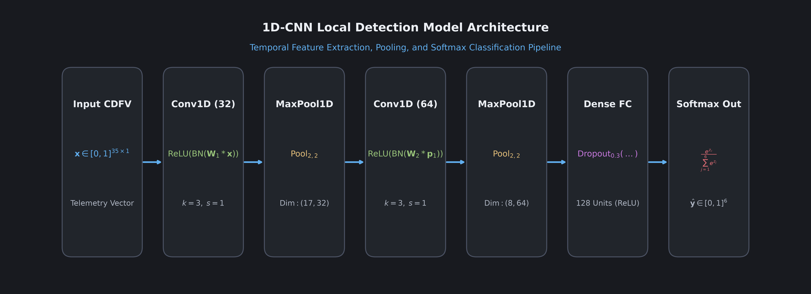

# Module 04: Edge 1D-CNN Architecture

---

**Corrected against the actual code.** This module previously described filter counts (32/64), dense width (128), dropout (30%), and output size (6 classes) that did not match `APTClassifier1DCNN`'s real default arguments in `src/models/cnn1d.py` (64/128 filters, 64-unit dense layer, 40% dropout, 7 output classes matching the 7 entries in `APT_STAGES`). All numbers below have been recalculated to match the real model.

---

## 1. Why 1D Convolution for Industrial Telemetry?

Industrial edge devices (such as industrial PCs and embedded gateways) have constrained computational resources. Selecting a neural network architecture requires balancing detection accuracy against computational cost:

- Why not 2D CNNs? 2D convolutions are designed for image grids with spatial height and width. Network telemetry is a 1D sequence of ordered metrics. Applying 2D convolutions requires artificial padding and wastes compute.
- Why not Recurrent Networks (LSTMs / GRUs)? LSTMs maintain hidden states sequentially across time steps. This recurrence prevents parallel processing and requires high memory, making edge deployment difficult.
- Why 1D CNNs? A 1D convolutional filter slides across adjacent feature groups, computing dot products to detect local patterns. 1D convolutions execute quickly via parallel matrix multiplications, have few parameters, and consume minimal memory.

---

## 2. Layer-by-Layer Architectural Specifications

The 1D-CNN processes a 35-dimensional CDFV input vector $\mathbf{x} \in [0, 1]^{35}$:

### Stage 1: Initial Temporal Feature Extraction
- Input Dimension: $(35, 1)$
- Conv1D Layer 1: 64 filters, kernel size $k = 3$, stride $s = 1$, padding same. Uses ReLU activation: $\text{ReLU}(z) = \max(0, z)$.
- Batch Normalization 1: Normalizes layer activations across mini-batches, stabilizing training and speeding up convergence:

$$
\hat{z} = \frac{z - \mu_B}{\sqrt{\sigma_B^2 + \epsilon_{\text{BN}}}}, \quad y = \gamma \hat{z} + \beta
$$

- MaxPool1D Layer 1: Window size 2, stride 2. Downsamples the representation from 35 to 17 positions by selecting the maximum activation in each window.

### Stage 2: Higher-Level Feature Abstraction
- Conv1D Layer 2: 128 filters, kernel size $k = 3$, stride $s = 1$, padding same. Uses ReLU activation.
- Batch Normalization 2: Re-centers feature distributions across the 128 channels.
- MaxPool1D Layer 2: Window size 2, stride 2. Downsamples from 17 to 8 positions, yielding a tensor of shape $(8, 128)$.

### Stage 3: Dense Representation and Regularization
- Flatten: Unrolls the $(8, 128)$ feature tensor into a 1D vector of length $8 \times 128 = 1{,}024$.
- Fully Connected Dense Layer: Projects the 1,024 features into 64 hidden representations using ReLU activation.
- Dropout Regularization: During training, randomly sets 40 percent of activations to zero ($p = 0.4$). This prevents the network from relying on any single feature subset, preventing overfitting.

### Stage 4: Multiclass Classification Output
- Fully Connected Output Layer: Projects 64 hidden units to 7 logits $z_0, z_1, \dots, z_6$, corresponding to the 7 APT stages (including Benign).
- Softmax Activation: Converts raw logits into normalized probabilities:

$$
\hat{y}_c = \frac{e^{z_c}}{\sum_{j=0}^6 e^{z_j}}, \quad c \in \{0, 1, \dots, 6\}
$$

The predicted class is the stage with the highest probability: $\hat{c} = \arg\max_c \hat{y}_c$.

---

## 3. Parameter Count and Memory Footprint

| Layer Name | Output Shape | Trainable Parameters | Memory Allocation |
|---|---|---|---|
| Input Layer | $(35, 1)$ | 0 | Negligible |
| Conv1D Layer 1 | $(35, 64)$ | $(3 \times 1 + 1) \times 64 = 256$ | 1.0 KB |
| Batch Normalization 1 | $(35, 64)$ | $2 \times 64 = 128$ | 0.5 KB |
| MaxPool1D 1 | $(17, 64)$ | 0 | 4.3 KB |
| Conv1D Layer 2 | $(17, 128)$ | $(3 \times 64 + 1) \times 128 = 24{,}704$ | 96.5 KB |
| Batch Normalization 2 | $(17, 128)$ | $2 \times 128 = 256$ | 1.0 KB |
| MaxPool1D 2 | $(8, 128)$ | 0 | 4.0 KB |
| Flatten | $(1{,}024)$ | 0 | 4.0 KB |
| Fully Connected (64) | $(64)$ | $(1{,}024 + 1) \times 64 = 65{,}600$ | 256.3 KB |
| Fully Connected (7) | $(7)$ | $(64 + 1) \times 7 = 455$ | 1.8 KB |
| **Total Model** | **Parameters: 91,399** | **Storage: ~357 KB** | **Runtime RAM: < 2 MB** |

Because the model requires under 400 kilobytes of storage and less than 2 megabytes of RAM, it runs efficiently on standard industrial edge gateways without requiring specialized GPU accelerators.

---

## 4. Local Optimization Formulation

Each client trains the model on its private dataset $D_k$ using the Multi-Class Cross-Entropy loss function:

$$
\mathcal{L}_{\text{CE}}(\theta) = - \frac{1}{|D_k|} \sum_{(\mathbf{x}, \mathbf{y}) \in D_k} \sum_{c=0}^6 y_c \ln \hat{y}_c
$$

Where $\mathbf{y}$ is the ground-truth one-hot label vector, and $\hat{y}_c$ is the predicted probability for stage $c$. Model parameters are updated using stochastic gradient descent (SGD) or Adam over $E$ local epochs.

---

## 5. Frequently Asked Questions

### Q: Why is Batch Normalization applied before pooling?
A: Normalizing activations before pooling preserves scale consistency across mini-batches, preventing extreme outlier values from dominating the max-pooling operation.

### Q: Can this model detect unknown zero-day attacks?
A: Yes. Because the model learns behavioral patterns (such as unusual payload entropy combined with elevated connection error rates) rather than static signatures, it identifies novel exploits that exhibit characteristic attack stages.

---

## 6. Next Learning Module

Proceed to [Module 05: Federated Learning Protocol](05_federated_learning_protocol.md) to understand how local models are coordinated and aggregated across multiple facilities using Federated Averaging.
