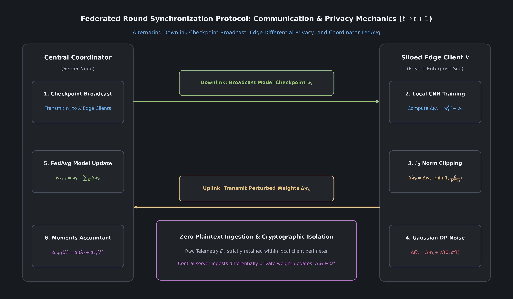

# Module 05: Federated Learning Protocol and Coordination

---

## 1. What Is Federated Learning?

Federated Learning (FL) is a distributed machine learning paradigm. Instead of sending raw training data to a central server, the model is sent to the data.

### The Centralized vs. Federated Approach
- Centralized Learning: 10 factories upload millions of raw network logs to a central cloud server. The server combines the records into one giant dataset and trains a model. Problem: Violates data privacy laws and exposes confidential industrial process data.
- Federated Learning: Each factory keeps all its raw network logs inside its own perimeter. Each factory trains the model locally. Then, each factory transmits only its model weight updates to a central coordinator. The coordinator averages these updates to produce an improved global model and broadcasts it back.



---

## 2. The Federated Averaging (FedAvg) Algorithm

The central coordinator uses the Federated Averaging (FedAvg) algorithm. In each round $t$:

1. The coordinator broadcasts global model weights $w_t$ to $K$ edge clients.
2. Each client $k$ sets its initial weights to $w_t$ and runs $E$ epochs of local training on its dataset $D_k$, producing updated weights $w_k^{(t)}$.
3. Each client computes its parameter update delta: $\Delta w_k = w_k^{(t)} - w_t$.
4. Clients apply differential privacy (gradient clipping and noise addition) to produce sanitized updates $\Delta \tilde{w}_k$.
5. The coordinator aggregates client updates using sample-weighted averaging:

$$
w_{t+1} = w_t + \sum_{k=1}^K \frac{n_k}{N} \Delta \tilde{w}_k, \quad \text{where } N = \sum_{k=1}^K n_k
$$

Where $n_k = |D_k|$ is the number of training samples hosted by client $k$, and $N$ is the total number of samples across all participating clients.

Weighting updates by sample size ensures that clients with larger telemetry datasets exert proportionally greater influence on the global model.

---

## 3. The 8-Phase Round Synchronization Lifecycle

Each training round follows 8 sequential phases:

```
Coordinator                             Client 1                 Client K
     |                                      |                        |
     |--- 1. Broadcast Checkpoint w_t ----->|                        |
     |-------------------------------------------------------------->|
     |                                      |                        |
     |                                2. Telemetry Ingestion   2. Telemetry Ingestion
     |                                3. Local 1D-CNN Train    3. Local 1D-CNN Train
     |                                4. L2 Norm Clipping      4. L2 Norm Clipping
     |                                5. Gaussian DP Noise     5. Gaussian DP Noise
     |                                      |                        |
     |<-- 6. Transmit Sanitized Delta ------|                        |
     |<-- 6. Transmit Sanitized Delta -------------------------------|
     |                                      |                        |
     | 7. Compute Weighted FedAvg           |                        |
     | 8. Update Moments Accountant Budget  |                        |
     |                                      |                        |
```

1. Checkpoint Distribution: The coordinator transmits $w_t$ to all connected nodes via TLS.
2. Local Telemetry Ingestion: Clients collect and normalize recent network flows into CDFV vectors.
3. Local Optimization: Clients train the 1D-CNN for $E = 2$ local epochs using mini-batch SGD.
4. Sensitivity Bounding: Clients clip update deltas: $\Delta \bar{w}_k = \Delta w_k \cdot \min(1, C / \|\Delta w_k\|_2)$.
5. Noise Perturbation: Clients add calibrated Gaussian noise: $\Delta \tilde{w}_k = \Delta \bar{w}_k + \mathcal{N}(0, \sigma^2 \mathbf{I})$.
6. Uplink Transmission: Clients transmit perturbed updates $\Delta \tilde{w}_k$ and sample counts $n_k$.
7. Central Aggregation: The coordinator calculates the weighted average and updates $w_{t+1}$.
8. Budget Tracking: The coordinator records round privacy expenditure using the Moments Accountant.

---

## 4. Handling Real-World Industrial Constraints

### Statistical Heterogeneity (Non-IID Telemetry)
In practice, network traffic is Non-IID (Not Independently and Identically Distributed). A water treatment plant experiences different traffic profiles than an automotive assembly line. PF-DAPTIV handles Non-IID data through:
- CDFV Standardization: Forces all clients into a common 35-dimensional feature space.
- Moderate Local Epochs ($E = 2$): Limits how far local client models drift from the global parameters before aggregation.

### Client Stragglers and Disconnections
Industrial networks experience intermittent disconnections. The coordinator enforces a quorum rule: if 80 percent of clients submit updates within the timeout window, aggregation proceeds without waiting for delayed nodes.

---

## 5. Frequently Asked Questions

### Q: Does the coordinator ever see raw client data?
A: Never. The coordinator receives only numerical parameter deltas ($\Delta \tilde{w}_k$). It has no access to packet payloads, IP addresses, or network logs.

### Q: What prevents a rogue client from sending poisoned weights to corrupt the model?
A: L2 norm clipping limits the maximum magnitude of any single client update to $C = 1.0$. Even if a rogue client generates extreme updates, the clipping mechanism prevents it from overriding the consensus of honest clients.

---

## 6. Next Learning Module

Proceed to [Module 06: Differential Privacy Mathematics](06_differential_privacy_mathematics.md) to explore the mathematical proofs and noise calibration equations that prevent model inversion attacks.
