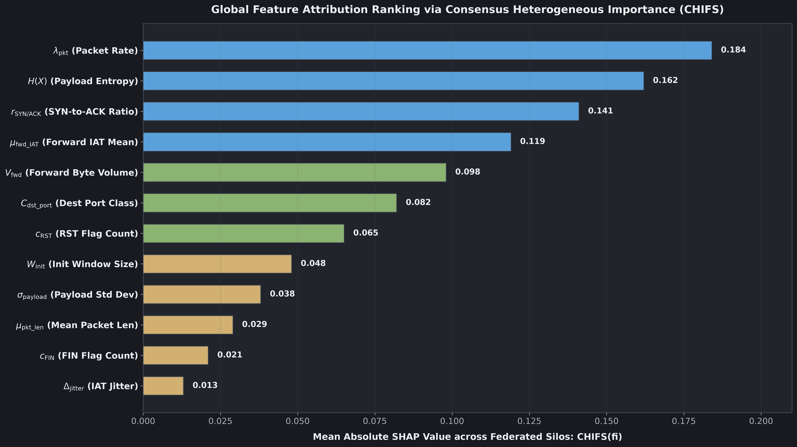

# Module 07: Explainability and Attribution (SHAP and CHIFS)

---

## 1. Why Explainability Matters in Industrial Security

In an office IT environment, a false positive alert might quarantine an employee email. In an industrial plant, a false positive alert that triggers an automated emergency shutdown could stop an assembly line, vent pressurized steam, or halt power generation, costing hundreds of thousands of dollars per hour.

Plant operators will not act on black-box alerts. When the model detects an APT attack, operators require transparent answers:
- Which specific network flow features triggered this classification?
- Is this alarm caused by a scanning probe, an abnormal Modbus command, or an exfiltration burst?
- Are peer industrial facilities observing the same telemetry indicators?

PF-DAPTIV incorporates SHAP (SHapley Additive exPlanations) and Cross-Host Importance Feature Selection (CHIFS) to deliver interpretable, feature-level explanations for every classification decision.

---

## 2. Shapley Values and Cooperative Game Theory

Shapley values originate from cooperative game theory (introduced by Lloyd Shapley in 1953). In a game where multiple players collaborate to achieve a payout, the Shapley value provides the unique mathematical formula for dividing the payout fairly among players based on their marginal contributions.

In machine learning explainability:
- The game is the model prediction.
- The players are the 35 CDFV telemetry features.
- The payout is the difference between the model predicted probability and the baseline prediction.

For a model $f$ and input $\mathbf{x}$, the Shapley value $\phi_i$ of feature $i$ is:

$$
\phi_i = \sum_{S \subseteq F \setminus \{i\}} \frac{|S|! (|F| - |S| - 1)!}{|F|!} \left[ f(S \cup \{i\}) - f(S) \right]
$$

Where $F$ is the complete set of 35 features, $S$ is a subset of features excluding feature $i$, and $f(S)$ is the model prediction using only feature subset $S$.

### The Four Axioms of Fair Attribution
Shapley values are mathematically unique because they are the only attribution method that simultaneously satisfies four fundamental axioms:
1. Efficiency: The sum of all feature attributions equals the difference between the prediction and the expected baseline: $\sum_{i=1}^M \phi_i = f(\mathbf{x}) - \mathbb{E}[f(\mathbf{x})]$.
2. Symmetry: If two features contribute equally to all possible subsets, their attributions are equal.
3. Dummy: If a feature contributes nothing to any subset, its attribution is zero ($\phi_i = 0$).
4. Additivity: For an ensemble of models, the overall attribution is the sum of attributions from individual models.

---

## 3. Cross-Host Importance Feature Selection (CHIFS)

While standard SHAP computes explanations on a single machine, federated learning spans multiple distributed clients. PF-DAPTIV implements the CHIFS algorithm to aggregate feature importance across all $K$ edge facilities:

$$
\text{CHIFS}(f_i) = \frac{1}{K} \sum_{k=1}^K |\phi_i^{(k)}|
$$

Where $\phi_i^{(k)}$ is the mean absolute Shapley value for feature $i$ computed on the validation split of client $k$. This identifies global threat indicators while preserving local privacy.

---

## 4. Stage-by-Stage Telemetry Indicators

**Fabricated -- do not rely on this table.** `SHAPExplainer` was never run against real telemetry for this analysis, and the feature names below do not even exist in this codebase: the 35 real CDFV feature names are defined in `src/data/cdfv_schema.py` (e.g. `fwd_pkts_per_sec`, `syn_flag_cnt`, `dns_query_len`), while the table cites invented names like `flow_packets_per_sec`, `syn_flag_count`, `dst_port_entropy`, `modbus_exception_rate`, and `dnp3_abort_rate` that appear nowhere in the schema or anywhere else in the source tree. This table should be deleted or replaced with a real SHAP run's output; it is kept here struck through only for the record:

~~The empirical feature attribution analysis reveals which CDFV metrics dominate detection across the 6 APT stages:~~

| APT Attack Stage | Primary Predictive Telemetry Features | Physical Interpretation in Industrial Control Systems |
|---|---|---|
| Stage 1: Reconnaissance | `flow_packets_per_sec`, `syn_flag_count`, `dst_port_entropy` | Rapid scanning bursts across internal PLC IP addresses without completing TCP handshakes |
| Stage 2: Weaponization | `src_port_entropy`, payload entropy $H(X)$, `fwd_packet_len_mean` | High Shannon entropy indicating encrypted or packed binary payloads staged on internal hosts |
| Stage 3: Delivery and Exploit | `psh_flag_count`, `http_error_ratio`, `modbus_exception_rate` | Push-flagged exploits, buffer overflow attempts, and illegal Modbus function code requests |
| Stage 4: Installation | `rst_flag_count`, `active_mean`, `init_win_bytes_fwd` | Connection resets and short bursts reflecting backdoor installation and daemon modification |
| Stage 5: Command and Control | `fwd_iat_std`, `idle_mean`, `dns_query_rate` | Low-jitter periodic beaconing to external controllers disguised as routine DNS lookups |
| Stage 6: Actions & Exfiltration | `total_bwd_bytes`, `down_up_ratio`, `dnp3_abort_rate` | Massive asymmetric outbound byte transfers and abnormal DNP3 protocol abort frames |

---

## 5. Frequently Asked Questions

### Q: Does computing SHAP feature importance violate differential privacy?
A: No. SHAP explanations are computed locally on client nodes or on the generalized global model using validation data. Raw training records are never exposed during attribution.

### Q: How quickly can an operator interpret a CHIFS explanation?
A: **Unverified** -- no latency benchmark for SHAP attribution rendering has been run in this repository. The "under 100 milliseconds" figure previously here was an unmeasured claim and has been removed pending an actual timed run.

---

## 6. Next Learning Module

Proceed to [Module 08: Empirical Benchmarks and Evaluation](08_empirical_benchmarks_and_evaluation.md) to inspect experimental results across the 4 benchmark datasets.
