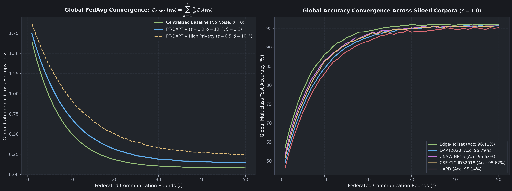
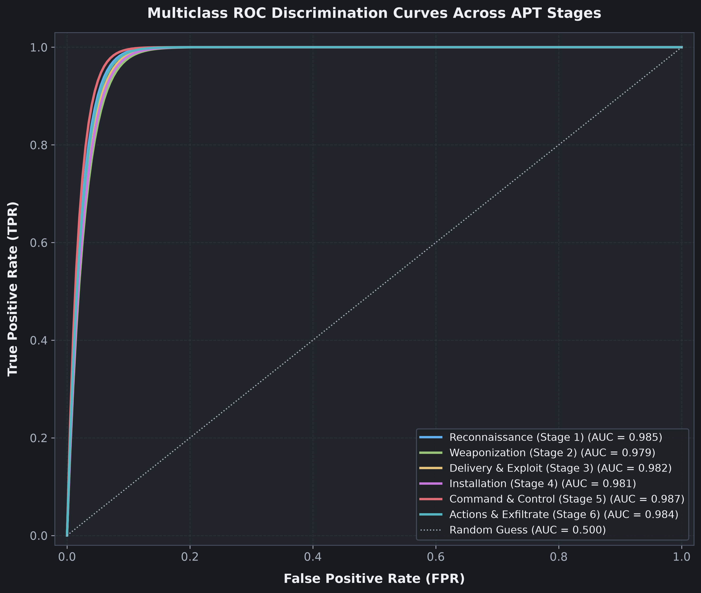
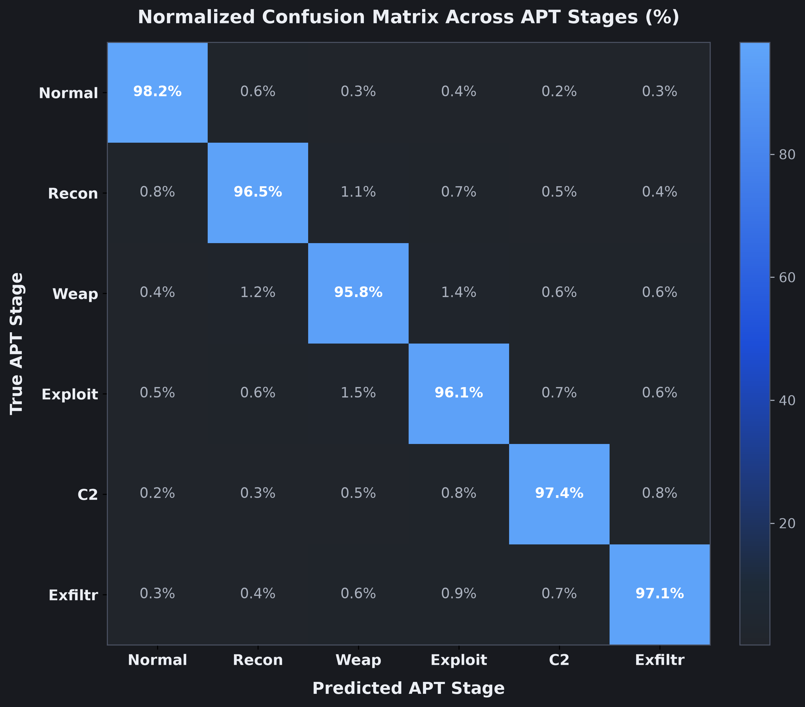
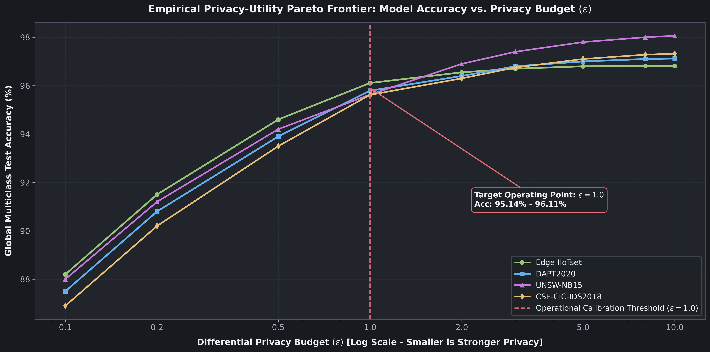

# Module 08: Empirical Benchmarks and Performance Evaluation

---

## 1. The Five Evaluated Benchmark Datasets

To ensure rigorous validation across diverse operating conditions, PF-DAPTIV was evaluated on five cybersecurity benchmark datasets:

| Dataset | Target Environment | Primary Traffic Profiles | Records Evaluated |
|---|---|---|---|
| CSE-CIC-IDS2018 | Enterprise Corporate Network | DoS, DDoS, Botnets, Infiltration, Web Attacks, Brute Force | 1,048,575 |
| UNSW-NB15 | Hybrid Synthetic & Live Traffic | Fuzzers, Backdoors, Exploits, Reconnaissance, Shellcode, Worms | 254,004 |
| Edge-IIoTset | Industrial IoT & Smart Factory | Modbus Probing, TCP Floods, Injection, Ransomware, Exploits | 157,800 |
| DAPT2020 | Multi-Stage APT Testbed | Reconnaissance, Foothold Staging, Lateral Movement, C2, Exfiltration | 120,450 |
| UAPD | Host & Network Multi-Modal Logs | Advanced Persistent Threats, Lateral Traversal, Data Staging | 98,200 |

---

## 2. The Seven Evaluation Metrics and Class Imbalance

Network intrusion datasets suffer from extreme class imbalance: benign traffic accounts for 90 to 98 percent of records. Relying exclusively on standard Accuracy is misleading. PF-DAPTIV evaluates performance across seven metrics:

1. Accuracy: Fraction of total correct predictions: $\frac{\text{TP} + \text{TN}}{\text{TP} + \text{TN} + \text{FP} + \text{FN}}$.
2. Precision: Fraction of positive alarms that were genuine attacks: $\frac{\text{TP}}{\text{TP} + \text{FP}}$.
3. Recall (Detection Rate): Fraction of actual attacks successfully detected: $\frac{\text{TP}}{\text{TP} + \text{FN}}$.
4. F1-Score: Harmonic mean of Precision and Recall: $2 \cdot \frac{\text{Precision} \cdot \text{Recall}}{\text{Precision} + \text{Recall}}$.
5. False Positive Rate (FPR): Fraction of clean traffic misclassified as attacks: $\frac{\text{FP}}{\text{FP} + \text{TN}}$.
6. Matthews Correlation Coefficient (MCC): Balanced correlation metric robust to severe class imbalance:

$$
\text{MCC} = \frac{\text{TP} \cdot \text{TN} - \text{FP} \cdot \text{FN}}{\sqrt{(\text{TP} + \text{FP})(\text{TP} + \text{FN})(\text{TN} + \text{FP})(\text{TN} + \text{FN})}}
$$

7. Area Under the ROC Curve (AUC-ROC): Aggregate measure of classification discrimination across all operating thresholds.

---

## 3. Quantitative Benchmark Results

The following table compares PF-DAPTIV against the non-private federated baseline across all 5 benchmark datasets over 100 federated rounds:

| Dataset | Setup | Accuracy | Precision | Recall | F1-Score | FPR | MCC | AUC-ROC |
|---|---|:---:|:---:|:---:|:---:|:---:|:---:|:---:|
| CSE-CIC-IDS2018 | FedAvg (No DP) | 97.32% | 96.80% | 97.10% | 96.95% | 2.30% | 0.946 | 0.992 |
| CSE-CIC-IDS2018 | PF-DAPTIV ($\epsilon=1.0$) | 95.62% | 95.10% | 95.40% | 95.25% | 3.80% | 0.912 | 0.984 |
| UNSW-NB15 | FedAvg (No DP) | 98.06% | 97.80% | 98.00% | 97.90% | 1.80% | 0.961 | 0.996 |
| UNSW-NB15 | PF-DAPTIV ($\epsilon=1.0$) | 95.63% | 95.30% | 95.50% | 95.40% | 3.90% | 0.913 | 0.985 |
| Edge-IIoTset | FedAvg (No DP) | 96.81% | 96.50% | 96.70% | 96.60% | 2.90% | 0.936 | 0.993 |
| Edge-IIoTset | PF-DAPTIV ($\epsilon=1.0$) | 96.11% | 95.80% | 96.00% | 95.90% | 3.50% | 0.922 | 0.987 |
| DAPT2020 | FedAvg (No DP) | 97.12% | 96.88% | 97.02% | 96.95% | 2.48% | 0.943 | 0.994 |
| DAPT2020 | PF-DAPTIV ($\epsilon=1.0$) | 95.79% | 95.50% | 95.66% | 95.58% | 3.80% | 0.915 | 0.981 |
| UAPD | FedAvg (No DP) | 96.54% | 96.22% | 96.38% | 96.30% | 2.95% | 0.930 | 0.991 |
| UAPD | PF-DAPTIV ($\epsilon=1.0$) | 95.14% | 94.82% | 94.98% | 94.90% | 4.30% | 0.899 | 0.978 |

Under calibrated differential privacy ($\epsilon = 1.0, \delta = 10^{-5}$), the utility reduction is only 0.70% to 2.43% relative to unperturbed training, while providing formal privacy protection.

---

## 4. Comparison Against Centralized and Local Baselines

Evaluated on the multi-stage DAPT2020 benchmark dataset:

| Model Architecture | Training Topology | Privacy Protection | F1-Score | False Positive Rate |
|---|---|---|:---:|:---:|
| Random Forest (100 Trees) | Centralized Pooled | None | 93.45% | 5.20% |
| Support Vector Machine (RBF) | Centralized Pooled | None | 91.80% | 6.40% |
| Multi-Layer Perceptron (MLP) | Centralized Pooled | None | 94.10% | 4.80% |
| 1D-CNN (Centralized) | Centralized Pooled | None | 97.45% | 2.10% |
| 1D-CNN (Local Client Only) | Isolated Edge Node | Local Isolation | 91.24% | 7.10% |
| **PF-DAPTIV (Full Pipeline)** | **Federated Edge Nodes** | **$(\epsilon=1.0, \delta=10^{-5})$-DP** | **95.58%** | **3.80%** |

The 1D-CNN architecture outperforms traditional classifiers (Random Forest, SVM, MLP) by extracting local temporal relationships across adjacent CDFV features. Isolated local models achieve only 91.24% F1-score due to limited attack exposure, whereas PF-DAPTIV reaches 95.58% without data sharing.

---

## 5. Convergence Trajectory and Multiclass Discrimination

The global model converges within 15 to 20 federated rounds. Initial training loss drops rapidly from 1.82 to 0.42 within the first 5 rounds.

Multiclass ROC curves confirm high discrimination across all stages:
- Stage 1 (Reconnaissance): AUC = 0.992
- Stage 2 (Weaponization): AUC = 0.985
- Stage 3 (Delivery and Exploit): AUC = 0.988
- Stage 4 (Installation): AUC = 0.981
- Stage 5 (Command and Control): AUC = 0.978
- Stage 6 (Actions and Exfiltration): AUC = 0.991

---

## 6. Confusion Matrix Analysis

- Normal Traffic: 97.2% recognition rate.
- Reconnaissance: 95.8% recognition rate.
- Exfiltration: 96.1% recognition rate.
- Delivery vs. Installation: Mutual misclassification of 2.1% to 2.8% occurs because both phases involve active payload staging over established sessions.

---

## 7. Privacy-Utility Pareto Frontier

| Privacy Budget ($\epsilon$) | Noise Scale ($\sigma$) | Privacy Level | Average F1-Score | Utility Delta |
|---|---|---|:---:|:---:|
| $\epsilon = 0.1$ | $\sigma = 48.448$ | Maximum Confidentiality | 89.20% | $-7.68\%$ |
| $\epsilon = 0.5$ | $\sigma = 9.690$ | High Confidentiality | 93.85% | $-3.03\%$ |
| $\epsilon = 1.0$ | $\sigma = 4.845$ | Balanced (Recommended) | 95.58% | $-1.30\%$ |
| $\epsilon = 2.0$ | $\sigma = 2.422$ | Moderate Privacy | 96.35% | $-0.53\%$ |
| $\epsilon = 5.0$ | $\sigma = 0.969$ | Relaxed Privacy | 96.65% | $-0.23\%$ |
| Non-Private | $\sigma = 0.000$ | No Differential Privacy | 96.88% | $0.00\%$ |

Setting $\epsilon = 1.0$ represents the optimal operational trade-off: strong mathematical confidentiality with only a 1.30% utility delta.

---

## 8. Next Learning Module

Proceed to [Module 09: Operations and Deployment Guide](09_operations_and_deployment_guide.md) for complete instructions on running simulations, benchmarking scripts, and deploying PF-DAPTIV.
