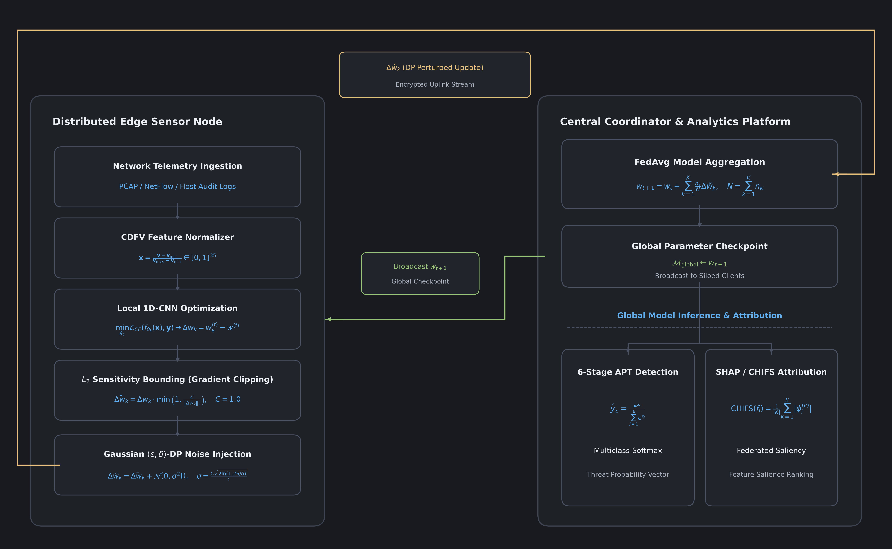

# PF-DAPTIV System Architecture Specification

---

## 1. Executive Technical Summary

PF-DAPTIV coordinates decentralized, privacy-preserving threat detection across distributed industrial edge facilities. The architecture couples local feature extraction, client-side differential privacy perturbation, and central sample-weighted aggregation:

---

## 2. Structural Component Specifications

### Edge Sensor Node Pipeline
1. Ingestion: Listens on physical network interfaces (SPAN/mirror ports) and industrial bus taps.
2. CDFV Projection: Maps incoming flow headers, TCP flags, payload entropy, and protocol frames into the 35-position CDFV template.
3. 1D-CNN Local Detection Model: Executes local inference and mini-batch gradient updates.
4. L2 Sensitivity Bounding: Enforces $\|\Delta w_k\|_2 \le C$ via norm clipping.
5. Local Differential Privacy: Perturbs clipped deltas using calibrated zero-mean Gaussian noise.
6. Uplink Stream: Transmits encrypted parameter updates to the central coordinator.

### Central Coordinator Platform
1. Model Broadcaster: Distributes global checkpoint $w_t$ to active edge clients.
2. FedAvg Aggregator: Computes weighted parameter consensus across participating clients.
3. Moments Accountant: Tracks cumulative privacy budget expenditure across all completed rounds.
4. Model Validator: Verifies global convergence on a held-out benchmark validation split.

---

## 3. Communication Protocol Sequence

The communication protocol operates in synchronous cycles:

$$
w_{t+1} = w_t + \sum_{k=1}^K \frac{n_k}{N} \Delta \tilde{w}_k
$$

Where:
- $w_t \in \mathbb{R}^d$ is the global model parameter vector at round $t$.
- $n_k$ is the local sample count at client node $k$.
- $N = \sum_{k=1}^K n_k$ is the total number of training records across all active clients.
- $\Delta \tilde{w}_k = \Delta \bar{w}_k + \mathcal{N}(0, \sigma^2 \mathbf{I}_d)$ is the perturbed parameter delta.

For complete theoretical derivations of the privacy engine, refer to [Module 06: Differential Privacy Mathematics](06_differential_privacy_mathematics.md) and [Privacy Math Reference](privacy_math.md).
