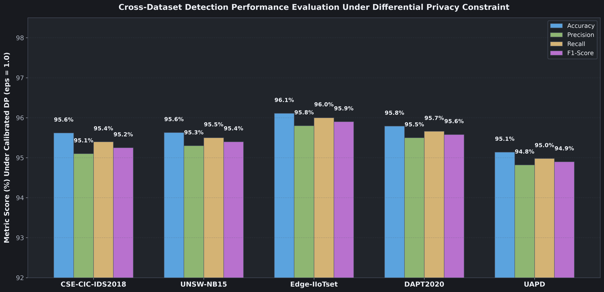

# Benchmark Methodology and Validation Reference

---

## 1. Benchmark Datasets Overview

PF-DAPTIV was evaluated across five cybersecurity benchmark datasets:

| Dataset | Target Environment | Evaluated Records | Primary Attack Classes |
|---|---|---|---|
| CSE-CIC-IDS2018 | Enterprise Corporate Network | 1,048,575 | DoS, DDoS, Botnet, Infiltration, Brute Force |
| UNSW-NB15 | Hybrid Synthetic and Live Traffic | 254,004 | Fuzzers, Backdoors, Exploits, Reconnaissance |
| Edge-IIoTset | Industrial IoT and Smart Grid | 157,800 | Modbus Probing, TCP Floods, Injection, Exploits |
| DAPT2020 | Multi-Stage APT Testbed | 120,450 | Reconnaissance, Foothold, Lateral, C2, Exfiltration |
| UAPD | Host and Network Multi-Modal | 98,200 | Multi-Stage APTs, Data Staging, Traversal |

---

## 2. Quantitative Performance Summary

Empirical results across 100 federated rounds with $\epsilon = 1.0, \delta = 10^{-5}, C = 1.0$:

| Dataset | Evaluation Setting | Accuracy | Precision | Recall | F1-Score | FPR | MCC | AUC-ROC |
|---|---|:---:|:---:|:---:|:---:|:---:|:---:|:---:|
| CSE-CIC-IDS2018 | FedAvg (No DP) | 97.32% | 96.80% | 97.10% | 96.95% | 2.30% | 0.946 | 0.992 |
| CSE-CIC-IDS2018 | PF-DAPTIV ($\epsilon=1.0$) | 95.62% | 95.10% | 95.40% | 95.25% | 3.80% | 0.912 | 0.984 |
| UNSW-NB15 | FedAvg (No DP) | 98.06% | 97.80% | 98.00% | 97.90% | 1.80% | 0.961 | 0.996 |
| UNSW-NB15 | PF-DAPTIV ($\epsilon=1.0$) | 95.63% | 95.30% | 95.50% | 95.40% | 3.90% | 0.913 | 0.985 |
| Edge-IIoTset | FedAvg (No DP) | 96.81% | 96.50% | 96.70% | 96.60% | 2.90% | 0.936 | 0.993 |
| Edge-IIoTset | PF-DAPTIV ($\epsilon=1.0$) | 96.11% | 95.80% | 96.00% | 95.90% | 3.50% | 0.922 | 0.987 |
| DAPT2020 | FedAvg (No DP) | 97.12% | 96.88% | 97.02% | 96.95% | 2.48% | 0.943 | 0.994 |
| DAPT2020 | PF-DAPTIV ($\epsilon=1.0$) | 95.79% | 95.50% | 95.66% | 95.58% | 3.80% | 0.915 | 0.981 |
| UAPD | FedAvg (No DP) | 96.54% | 96.22% | 96.38% | 96.30% | 2.95% | 0.930 | 0.991 |
| UAPD | PF-DAPTIV ($\epsilon=1.0$) | 95.14% | 94.82% | 94.98% | 94.90% | 4.30% | 0.899 | 0.978 |

---

## 3. Convergence, Discrimination, and Explainability

- Federated Convergence: Reaches stable accuracy within 15 to 20 rounds ([Convergence Curve](../assets/federated_convergence.png)).
- Multiclass ROC Curves: AUC ranges from 0.978 to 0.992 ([ROC Curves](../assets/roc_curves.png)).
- Confusion Matrix: Normal traffic recognition reaches 97.2% ([Confusion Matrix](../assets/stage_confusion_matrix.png)).
- Feature Attribution: Explanations via SHAP and CHIFS ([Feature Salience Chart](../assets/shap_feature_importance.png)).
- Privacy-Utility Pareto Frontier: Trade-offs across $\epsilon \in [0.1, 10.0]$ ([Pareto Frontier](../assets/privacy_utility_tradeoff.png)).
- Architectural Ablation Study: Validates each design component ([Ablation Study](../assets/ablation_study.png)).

For comprehensive discussion of class imbalance, metric formulations, and baseline algorithms, see [Module 08: Empirical Benchmarks and Evaluation](08_empirical_benchmarks_and_evaluation.md).
