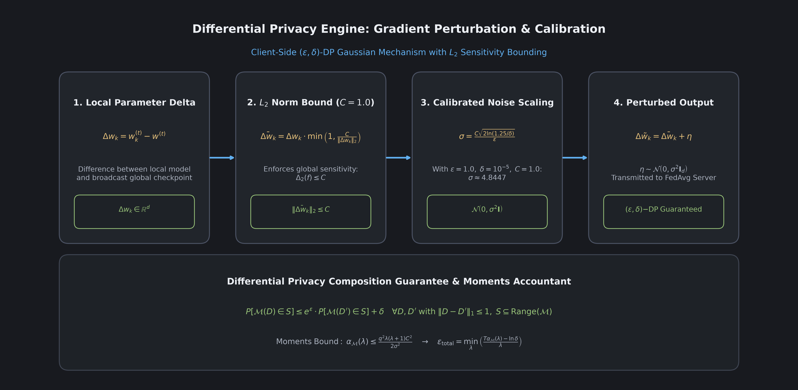
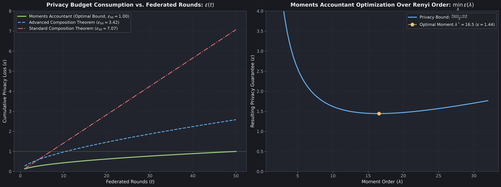

# Differential Privacy Formulation and Mathematics Reference

---

## 1. Formal Mathematical Foundation

A randomized algorithm $\mathcal{M}$ guarantees $(\epsilon, \delta)$-Differential Privacy if for all neighboring datasets $D, D'$ differing by at most one telemetry record ($\|D - D'\|_1 \le 1$), and for every subset of outputs $S \subseteq \text{Range}(\mathcal{M})$:

$$
\mathbb{P}[\mathcal{M}(D) \in S] \le e^{\epsilon} \cdot \mathbb{P}[\mathcal{M}(D') \in S] + \delta
$$

---

## 2. Client-Side Sensitivity Bounding and Noise Calibration

### Sensitivity Bounding via L2 Norm Clipping
To cap the influence of any single client sample on the weight update delta $\Delta w_k = w_k^{(t)} - w_t$, the update is clipped by threshold $C > 0$:

$$
\Delta \bar{w}_k = \Delta w_k \cdot \min\left(1, \frac{C}{\|\Delta w_k\|_2}\right)
$$

This guarantees that $\|\Delta \bar{w}_k\|_2 \le C$ and bounds global L2 sensitivity: $\Delta_2(f) \le C$.

### Calibrated Gaussian Noise Addition
Zero-mean Gaussian noise is sampled and added:

$$
\Delta \tilde{w}_k = \Delta \bar{w}_k + \boldsymbol{\eta}, \quad \boldsymbol{\eta} \sim \mathcal{N}\left(0, \sigma^2 \mathbf{I}_d\right)
$$

Where:

$$
\sigma = \frac{C \sqrt{2 \ln(1.25 / \delta)}}{\epsilon}
$$

### Numerical Walkthrough for Baseline Parameters
For $C = 1.0, \epsilon = 1.0, \delta = 10^{-5}$:

$$
\frac{1.25}{10^{-5}} = 125{,}000, \quad \ln(125{,}000) \approx 11.73607
$$

$$
2 \times 11.73607 = 23.47214, \quad \sqrt{23.47214} \approx 4.8448
$$

$$
\sigma = \frac{1.0 \times 4.8448}{1.0} \approx 4.8448
$$

---

## 3. Multi-Round Privacy Composition

Over $T$ federated training rounds, the Moments Accountant tracks log moments:

$$
\alpha_{\mathcal{M}}(\lambda) \le \frac{q^2 \lambda (\lambda + 1) C^2}{2 \sigma^2}
$$

Total privacy expenditure is computed by converting cumulative log moments back to standard DP:

$$
\epsilon_{\text{total}} = \min_{\lambda > 1} \left( \frac{T \cdot \alpha_{\mathcal{M}}(\lambda) - \ln \delta}{\lambda - 1} \right)
$$

For full comparative analyses and background on Renyi Differential Privacy, refer to [Module 06: Differential Privacy Mathematics](06_differential_privacy_mathematics.md).
